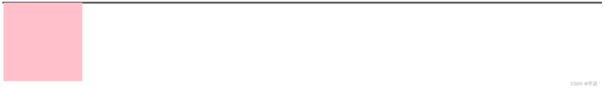
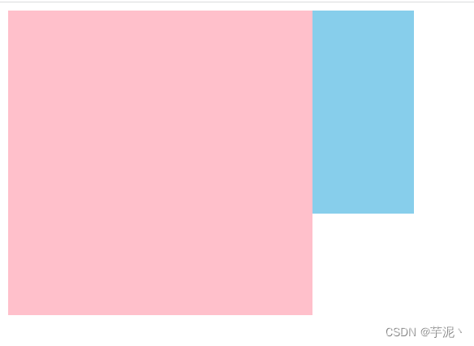
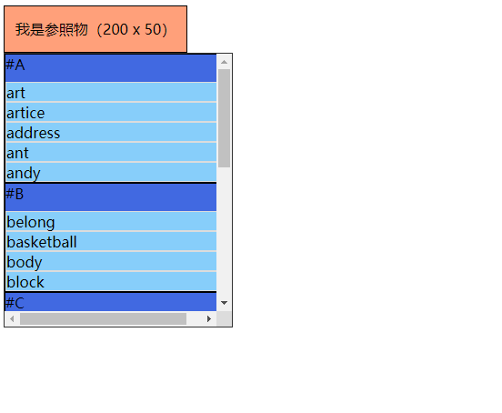

## 盒模型
盒模型定义每个盒子的组成部分：`content` + `padding` + `border` + `margin`

标准盒模型：`width`，`height` 设置的是 `content`，加上 `padding`，`border` 后，表示盒子的大小

传统盒模型：`width`，`height` 设置的是可见宽高，即除 `content` 外，还包含 `padding`，`border`

**怎么设置盒子模型标准**

设置 `box-sizing`，默认使用标准模型（`box-sizing: content-box`）

| 值          | 描述                                                         |
| :---------- | :----------------------------------------------------------- |
| content-box | 这是由 CSS2.1 规定的宽度高度行为。宽度和高度分别应用到元素的内容框。在宽度和高度之外绘制元素的内边距和边框。 |
| border-box  | 为元素设定的宽度和高度决定了元素的边框盒，通过从已设定的宽度和高度分别减去边框和内边距才能得到内容的宽度和高度。 |
| inherit     | 规定应从父元素继承 box-sizing 属性的值。 

## 两栏布局
[参考博客](https://blog.csdn.net/baidu_36065997/article/details/80279305)
- 情况1：左侧固定宽度，右侧自适应
1. `flex`布局，左侧固定宽度 + 右侧`flex:1`
2. 左侧`float:left`并设置宽度，右侧`overflow:hidden`
3. 左侧`float:left`，右侧`margin-left`固定宽度
4. 子绝父相 + 左侧设置宽度 + 右侧(`absolute`+`left`固定宽度)
- 情况2：左侧不定宽，右侧自适应
1. 左侧`float:left`，右侧`overflow:hidden`
2. `flex`布局，左侧固定宽度 + 右侧`flex:1`

## 浮动
浮动元素会脱离文档流，不会保留原本的位置
浮动的盒子会影响**下面**的**未设置浮动**的盒子，**不会影响上面的盒子**

### 产生的问题
1. 当父元素没有设置高度，子元素浮动脱离文档流，父元素不会被子元素撑开，造成高度塌陷


```css
 .box1 {
    border: 2px solid black;
}
 
.box1 .son {
    float: left;
    background-color: pink;
}
```

2. 对兄弟元素的影响：当第一个元素设置左浮动，第二个元素正常，会造成第一个元素遮盖第二个元素




### 清除浮动
清除浮动的`本质`是清除浮动脱离标准流带来的影响

参考：[原理案例-详细解释](https://blog.csdn.net/weixin_45842954/article/details/125081389)

1. 在浮动元素后增加一个空元素，并设置CSS属性：`clear:both` 
代码少，简单，但不符合语义化，代码不优雅，后期维护不易
**原理**：添加一个空`div`，利用`css`提高的
`clear:both`清除浮动，让父级`div`能自动获取到高度。

2. 父元素属性中设置 `overflow:hidden`或`overflow:auto`，触发BFC
内容增多时不会换行导致内容被隐藏掉，无法显示要溢出的元素。

3. 父元素 伪类:after中设置 （**推荐**）
```css
/* 原理跟第一种方法一样 */
.root:after{
    content: '';
    display: block;
    clear: both;
}
/* 兼容IE6以下，触发其hasLayout属性 */
.root{
    zoom: 1;
}
```


## `display:none` 和 `visibility:hidden` 的区别
相同点：都能隐藏元素
不同点：
1. 是否占据空间
`display:none`将元素的显示设为无，即在网页中不占任何的位置。
`visibility:hidden`将元素隐藏，但是在网页中该占的位置还是占着。
2. 是否具有继承属性
`display:none`，`display`不是继承属性，元素及其子元素都会消失。
`visibility:hidden`，`visibility`是继承属性，若子元素使用了`visibility:visible`，则不继承，这个子孙元素又会显现出来。
3. 是否渲染
`display:none`，会触发reflow（回流），进行渲染。
`visibility:hidden`，只会触发repaint（重绘），因为没有发现位置变化，不进行渲染。
4. 读屏器是否读取
读屏器不会读取`display：none`的元素内容，而会读取`visibility：hidden`的元素内容。比如在有序列表中 `visibility：hidden`是参与计数的。

## BFC
`BFC（Block Formatting Context）`块格式化上下文，指的是一个独立的渲染空间或隔离开的独立容器，将内部内容与外部上下文隔开，不会和外部的元素相互影响或重叠。

### BFC 的好处
① 阻止标准流元素被浮动元素覆盖
② 解决外边距的塌陷问题(垂直塌陷)
③ 利用BFC解决包含塌陷
④ 清除浮动
例子：[BFC实用例子](https://blog.csdn.net/sqLeiQ/article/details/125261564)

### 形成BFC的条件
* 根元素：`HTML`
* `float` 设为非 `none` 的值，如 `left`，`right`
* `overflow` 设为非 `visible` 的值，如 `hidden`，`auto`，`scroll`
* `position: absolute` 或 `position:fixed`
* 块级容器，如 `display: inline-block`, `table-cell`，`table-caption`，`flex`，`inline-flex`，`grid`，`inline-grid`


## CSS3新特性
CSS3的新特性大致分为以下六大类
- CSS3选择器
- CSS3边框与圆角
- CSS3背景与渐变
- CSS3过渡
- CSS3变换
- CSS3动画


## position的值
- static(静态)：默认
- relative(相对定位)：设置 `left`、`right`、`bottom`、`top`等值进行偏移，相对于 属性值为 `static`时的位置
- absolute(绝对定位)：设置 `left`、`right`、`bottom`、`top`等值进行偏移，相对于 最近的非 `static` 定位的祖先元素进行偏移,当没有非`static`定位的祖先元素时，相对于`html`发生偏移
- fixed(固定定位):设置 `left`、`right`、`bottom`、`top`等值进行偏移，相对于**屏幕视口**
- sticky(粘性定位)：元素在跨越特定阈值前为相对定位，之后为固定定位，阈值是相对它的最近滚动祖先定义的，而`sticky`的作用区域也是它的第一个非`static`父元素内。



```html
<style>
    .c-box{
        background-color: #FFA07A;
        width: 200px;
        height: 50px;
        font-size: 16px;
        line-height: 50px;
        border: 1px solid #333;
        text-align: center;
    }

    .p-container{
        width: 250px;
        height: 300px;
        overflow-y: scroll;
        border: 1px solid #333;
    }

    .container{
        list-style: none;
        padding: 0;
        margin: 0;
        position: relative;
    }

    .h-item{
        background-color: #4169E1;
        position: sticky;
        top: 0;
    }

    .item{
        background-color: #87CEFA;
        border-top: 1px solid #fff;
    }
</style>
<body>
    <div class="c-box">我是参照物（200 x 50）</div>
    <div class="p-container">
        <ul class="container">
            <li class="h-item">#A</li>
            <li class="item">art</li>
            <li class="item">artice</li>
            <li class="item">address</li>
            <li class="item">ant</li>
            <li class="item">andy</li>
        </ul>
        <ul class="container">
            <li class="h-item">#B</li>
            <li class="item">belong</li>
            <li class="item">basketball</li>
            <li class="item">body</li>
            <li class="item">block</li>
        </ul>
        <ul class="container">
            <li class="h-item">#C</li>
            <li class="item">canvas</li>
            <li class="item">circle</li>
            <li class="item">container</li>
        </ul>
        <ul class="container">
            <li class="h-item">#D</li>
            <li class="item">dance</li>
            <li class="item">detail</li>
            <li class="item">disco</li>
        </ul>
        <ul class="container">
            <li class="h-item">#E</li>
            <li class="item">edit</li>
            <li class="item">edge</li>
            <li class="item">element</li>
        </ul>
        <ul class="container">
            <li class="h-item">#F</li>
            <li class="item">father</li>
            <li class="item">fashion</li>
            <li class="item">fantastic</li>
        </ul>
    </div>
</body>

```

## CSS选择器与权重
`important`无限大、内联样式1000、id选择器100、类选择器 伪类 属性选择器10、元素选择器 伪元素1 、通配符 0 
权重会累加、 权重相同时后面会覆盖前面的

## 块级盒子和内联盒子的区别
1. 换行 

    每个块级盒子都会换行；行内盒子不会换行
2. 默认宽高

    块级盒子默认宽度为父盒子的宽度100%，默认高度取决于内容本身；
    内联盒子默认宽高都取决于内容本身。
3. 设置宽高

    块级盒子可设置属性 `width`和`height`控制宽高；
    内联盒子直接设置不起作用，需要设置 `display:block` 或 `display:inline-block` 变成块级盒子后，再设置宽高。
4. 内外边距及边框

   块级盒子设置内外边距，边框大小后，水平垂直方向都被应用，且能将其他元素按预期推开；内联元素设置这些属性后，水平垂直方向都被应用，但是只有水平方向会按预期将元素推开

5. 包含的元素

   块级元素可以包含块级元素和行内元素；

   行内元素中最好只包含行内元素，如包含块级元素，父行内元素并不会包含子块级元素